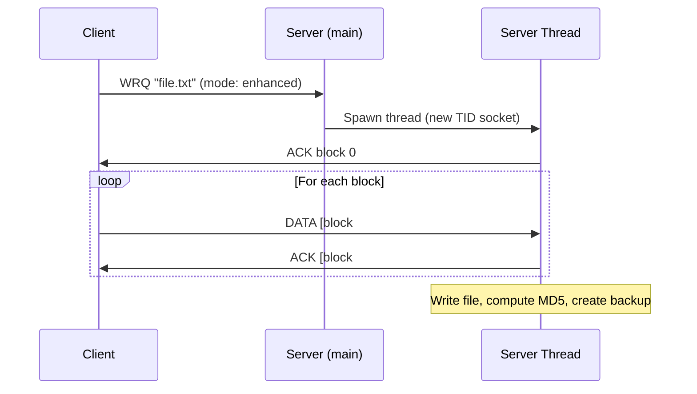

# UDP-Based File Transfer System – Enhanced TFTP

## Project Overview

A complete file transfer system over UDP in C, inspired by TFTP but with improved packet management, AES-256-CBC encryption, automatic backup/recovery, MD5 integrity checks, and multithreaded client handling.

---

## File Structure

| File | Purpose |
|------|---------|
| [udp_file_transfer.h](file:///home/ben-shabatuntu/Desktop/DEV/tftp/final/udp_file_transfer.h) | Shared header – packet structs, constants, AES encrypt/decrypt, MD5, utilities |
| [server.c](file:///home/ben-shabatuntu/Desktop/DEV/tftp/final/server.c) | Multithreaded server – RRQ, WRQ, DELETE handling, backup & recovery |
| [client.c](file:///home/ben-shabatuntu/Desktop/DEV/tftp/final/client.c) | Interactive client – upload, download, delete with encryption & integrity checks |
| [Makefile](file:///home/ben-shabatuntu/Desktop/DEV/tftp/final/Makefile) | Build system with `make`, `make clean`, `make test` targets |

---

## Build & Run

```bash
# Build both binaries
make

# Terminal 1 – start the server
./server 6969

# Terminal 2 – run the client
./client 127.0.0.1 6969
```

The client presents an interactive menu:
```
╔══════════════════════════════════════╗
║     Enhanced TFTP Client – Menu      ║
╠══════════════════════════════════════╣
║  1)  Upload a file                   ║
║  2)  Download a file                 ║
║  3)  Delete a file                   ║
║  4)  Quit                            ║
╚══════════════════════════════════════╝
```

---

## Architecture



## Key Design Decisions

### Packet Format
All structs use `__attribute__((packed))` to guarantee wire-format alignment with no compiler padding. Opcodes 1-5 match standard TFTP; opcodes 6-7 are extensions for DELETE.

### Enhanced Block Size
Standard TFTP uses 512-byte blocks. This system defaults to **4096 bytes** for the enhanced client, but falls back to 512 bytes when the mode string is `"octet"` or `"netascii"` (standard TFTP compatibility).

### Encryption
Every DATA payload is encrypted with **AES-256-CBC** using OpenSSL's EVP API. The shared key/IV are hardcoded for the exercise — in production you'd use a key exchange protocol.

### Backup & Recovery
- On every successful upload, the server copies the file to `./server_files/backup/<name>.<timestamp>.bak`
- On a RRQ for a missing file, the server automatically attempts recovery from the latest backup

### Reliability
- Each DATA packet is ACK'd before the next is sent (stop-and-wait)
- Up to 5 retransmissions with 3-second timeouts
- Duplicate block detection with re-ACK

### Multithreading
Each incoming request spawns a detached pthread on a new ephemeral UDP socket (unique TID), matching TFTP's transfer-ID semantics.
